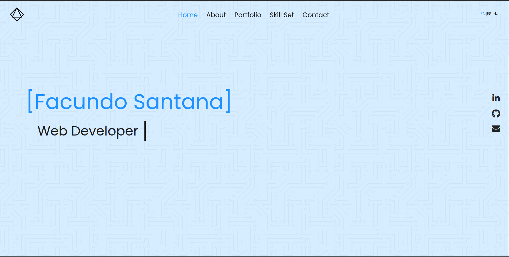
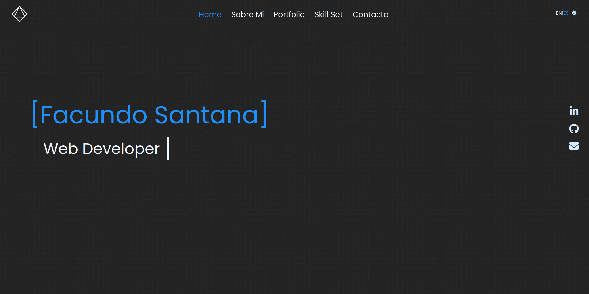
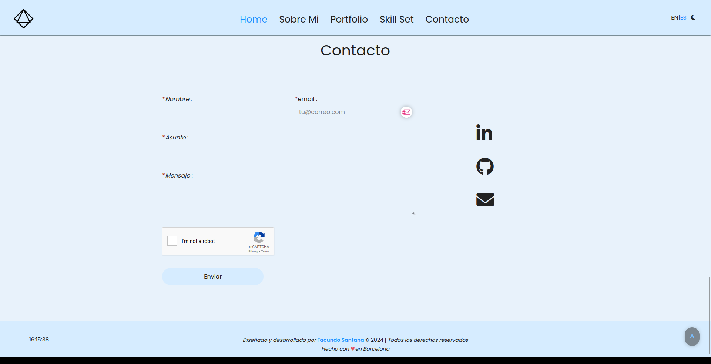

## Table of Contents

1. [General Info](#general-info)
2. [Technologies](#technologies)
3. [Collaboration](#collaboration)
4. [FAQs](#faqs)

### General Info

---

Welcome to my portfolio website! This is a showcase of my skills, projects, and achievements.
My portfolio website combines modern design, and responsiveness to showcase my skills and accomplishments effectively.

The website is designed to adapt seamlessly to various screen sizes, ensuring a consistent and user-friendly experience across devices, including desktops, tablets, and mobile phones.
It incorporates modern and minimalistic design principles, with clean and elegant aesthetics. It provides an intuitive and visually pleasing interface for visitors to explore.

The website also includes a dedicated contact section, allowing visitors to reach out to me directly. It provides contact details and a contact form, making it convenient for potential clients or collaborators, feel free to explore and get in touch with any inquiries or opportunities.

### Screenshot

---

## Technologies

---

A list of technologies used within the project:

- [HTML](https://www.w3.org/html/): Version 5
- [CSS](https://www.w3.org/Style/CSS/): Version 4
- [JavaScript](https://en.wikipedia.org/wiki/JavaScript)
- [Bootstrap](https://getbootstrap.com/): Version 5.3.0
- [jQuery](https://jquery.com/): Version 3.6.4
- [Flexbox](https://example.com): Version 1234

The use of HTML5, CSS3, JavaScript, Bootstrap, jQuery, and Flexbox enables a seamless and engaging experience for visitors.

## Collaboration

---

> "Coming together is a beginning; keeping together is progress; working together is success."
> **Henry Ford**

On this proyect, i had the pleasure of collaborating with [Oscar Burgos](https://www.linkedin.com/in/oscar-burgos-pacheco/), a talented and experienced web developer.I am extremely grateful for Oscar's contributions and expertise in making this project a success.

If you think we can collaborate on any project, feel free to [conntact me](mailto:facundosantana.tm@gmail.com).

## FAQs

---

1. **What technologies and programming languages are you proficient in?**

   As a web developer, I have expertise in a range of technologies and programming languages.

   - _Frontend_:

     - JavaScript: I have knowledge of JavaScript and its various frameworks and libraries, including jQuery.
     - HTML: I am well-versed in HTML (including HTML5) and can assist with structuring web content.
     - CSS: I can help with CSS styling and layout to create visually appealing web pages.
     - Bootstrap: I am familiar with Bootstrap and can assist in creating responsive and mobile-friendly designs.

   - _Backend_:

     - Python: I have a strong understanding of Python, including its syntax, data structures, and commonly used libraries.
     - Django: I am proficient in Django.
     - NumPy: Additionally, I have experience working with libraries like NumPy.

   - _Databases_:

     I have proficiency in MySQL, NoSQL, and MariaDB. These database systems enable me to store and retrieve data efficiently, ensuring the smooth functioning of your web applications.

     - MySQL
     - NoSQL
     - MariaDB

2. **How can I contact you for potential collaborations or job opportunities?**

   You can contact me by mail to: facundosantana.tm@gmail.com
   .

3. **Are you available for freelance work?**

   Yes

4. **Are you open to working with clients remotely or do you prefer on-site work?**

   I am open to work both, remotely and on-site.
